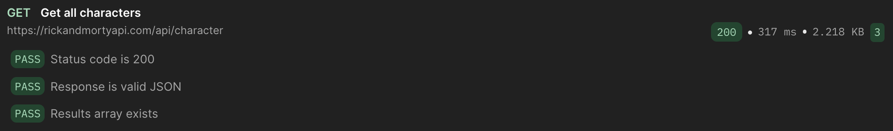
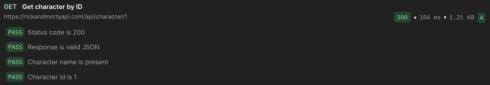
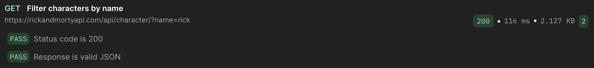
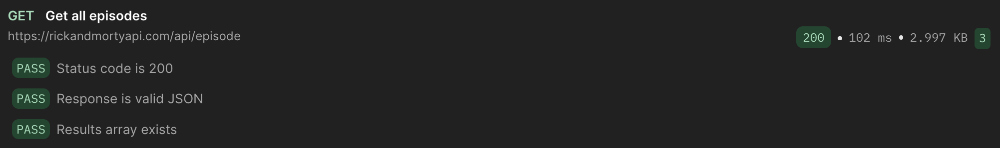
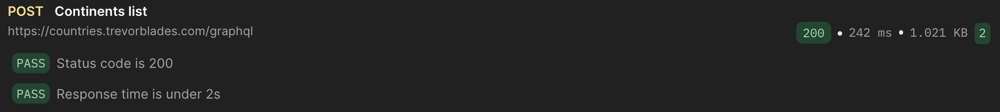
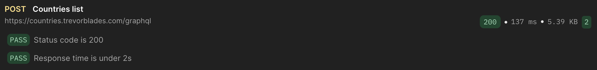
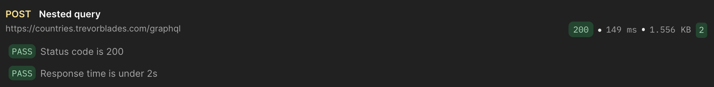
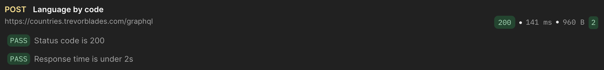

# APIs en Postman

## 1) Parte REST

### API elegida
Elegi la API de **Rick and Morty** (`https://rickandmortyapi.com/api`) porque:
- Es publica y gratuita.
- No requiere registro ni token.
- Tiene varios recursos utiles para practicar (`character`, `episode`, `location`).
- Permite usar filtros con query params.

### Datos que devuelve
La API devuelve informacion en formato JSON sobre:
- Personajes (nombre, estado, especie, origen, episodios, imagen, etc.).
- Episodios (nombre, fecha, personajes asociados).
- Ubicaciones (dimension, residentes, tipo).

### Autenticacion
No usa token. No requiere autenticacion para consultas basicas.

### Requests realizados
Se realizaron 5 requests REST (todos con metodo GET):

| # | Request | Endpoint | Tipo | Status Code | Observacion |
|---|---|---|---|---|---|
| 1 | Get all characters | `/character` | Lista general | 200 | Trae lista paginada de personajes |
| 2 | Get character by ID | `/character/1` | Por ID | 200 | Devuelve a Rick Sanchez |
| 3 | Filter characters by name | `/character/?name=rick` | Filtro (query param) | 200 | Cumple requisito de query params |
| 4 | Get all episodes | `/episode` | Lista general | 200 | Devuelve episodios paginados |
| 5 | Get all locations | `/location` | Lista general | 200 | Devuelve ubicaciones paginadas |

### Tests automaticos
En cada request se validaron minimo 2 pruebas automaticas en Postman (por ejemplo):
- `Status code is 200`
- `Response time is under 2s`

### Evidencia (capturas)

#### Get all characters

#### Get character by ID

#### Filter characters by name

#### Get all episodes

#### Get all locations

### Que aprendi diferente frente a JSONPlaceholder
Comparado con JSONPlaceholder:
- Rick and Morty tiene datos mas realistas y estructuras mas completas.
- Se observa mejor el uso de paginacion y filtros reales.
- Los recursos tienen relaciones mas claras (personajes, episodios y ubicaciones).
- Permite practicar consultas mas cercanas a escenarios reales.

---

## 2) Parte GraphQL

### API usada
Se utilizo la API GraphQL de Countries:  
`https://countries.trevorblades.com/graphql`

### Coleccion
Nombre de coleccion en Postman:  
**Tarea GraphQL - Cristian**

### Queries realizadas (minimo 5)

| # | Query | Tipo | Cumple requisito |
|---|---|---|---|
| 1 | Continents list | Basica | Si |
| 2 | Countries list | Basica | Si |
| 3 | Filter by argument (`country(code: "CO")`) | Con argumento/filtro | Si |
| 4 | Nested query (`continent { countries { ... } }`) | Anidada | Si |
| 5 | Language by code (`language(code: "es")`) | Con argumento | Si |

### Tests automaticos
En cada query se validaron minimo 2 pruebas automaticas en Postman (por ejemplo):
- `Status code is 200`
- `Response time is under 2s`

### Evidencia (capturas)

#### Continents list

#### Countries list

#### Filter by argument

#### Nested query

#### Language by code

---

## 3) Preguntas de analisis (GraphQL vs REST)

### Que diferencia encontraste vs REST?
En REST se consumen varios endpoints distintos y a veces se obtiene informacion de mas o de menos.  
En GraphQL se usa un solo endpoint y el cliente pide exactamente los campos que necesita.

### Cuantos requests REST necesitarian para reemplazar la query mas compleja?
Para reemplazar la query anidada de continente con lista de paises, en REST normalmente se necesitarian al menos **2 o mas requests** (dependiendo de como este disenada la API REST).

### En que proyecto real usarias GraphQL?
Lo usaria en un proyecto con frontend web y app movil donde diferentes pantallas necesitan distintos campos de los mismos datos (por ejemplo, un dashboard internacional con paises, idiomas y regiones), para optimizar consumo y evitar overfetching.
