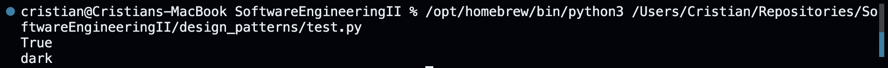
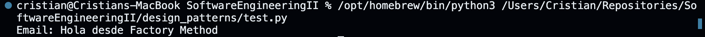
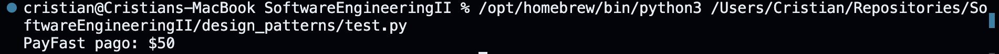
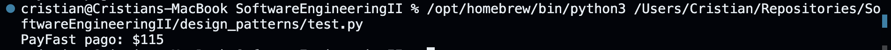

# Patrones de diseño

Actividad sobre patrones de diseno en Python. Se presentan:
- 2 patrones creacionales (Singleton y Factory Method).
- 1 patrón estructural combinado con el creacional (Adapter + Factory).
- 1 patrón de comportamiento combinado con los anteriores (Strategy + Factory + Adapter).

---

## 1) Patrón creacional: Singleton

### Definicion breve
Asegura que una clase tenga una unica instancia y provee un punto global de acceso.

### Ejemplo (Python)

```python
class AppConfig:
    _instance = None

    def __new__(cls):
        if cls._instance is None:
            cls._instance = super().__new__(cls)
            cls._instance.theme = "light"
            cls._instance.language = "es"
        return cls._instance


if __name__ == "__main__":
    c1 = AppConfig()
    c2 = AppConfig()

    c1.theme = "dark"

    print(c1 is c2)          # True
    print(c2.theme)          # dark
```

### Explicación
- La primera vez que se crea `AppConfig`, se guarda la instancia en `_instance`.
- Las siguientes veces se devuelve la misma referencia.

### Evidencia (captura)


---

## 2) Patrón creacional: Factory Method

### Definición
Define una interfaz para crear objetos, pero deja la creacion a las subclases.

### Ejemplo (Python)

```python
from abc import ABC, abstractmethod


class Notificador(ABC):
    @abstractmethod
    def enviar(self, mensaje: str) -> None:
        pass


class EmailNotificador(Notificador):
    def enviar(self, mensaje: str) -> None:
        print(f"Email: {mensaje}")


class SMSNotificador(Notificador):
    def enviar(self, mensaje: str) -> None:
        print(f"SMS: {mensaje}")


class NotificadorFactory(ABC):
    @abstractmethod
    def crear(self) -> Notificador:
        pass


class EmailFactory(NotificadorFactory):
    def crear(self) -> Notificador:
        return EmailNotificador()


class SMSFactory(NotificadorFactory):
    def crear(self) -> Notificador:
        return SMSNotificador()


if __name__ == "__main__":
    factory = EmailFactory()
    notificador = factory.crear()
    notificador.enviar("Hola desde Factory Method")
```

### Explicación
- `NotificadorFactory` define el método `crear()`.
- Cada subclase decide que tipo concreto instanciar.

### Evidencia (captura)


---

## 3) Patrón estructural: Adapter (combinado con Factory)

### Definición
Permite que dos interfaces incompatibles trabajen juntas mediante un adaptador.

### Idea de combinación
- Usamos Factory Method para crear un proveedor de pagos.
- El proveedor externo tiene una interfaz distinta.
- El Adapter traduce la llamada de `pagar()` al método real del proveedor.

### Ejemplo (Python)

```python
from abc import ABC, abstractmethod


class ProveedorPago(ABC):
    @abstractmethod
    def pagar(self, monto: float) -> None:
        pass


class PayFastSDK:
    def do_payment(self, amount: float) -> None:
        print(f"PayFast pago: ${amount}")


class PayFastAdapter(ProveedorPago):
    def __init__(self, sdk: PayFastSDK) -> None:
        self.sdk = sdk

    def pagar(self, monto: float) -> None:
        self.sdk.do_payment(monto)


class ProveedorFactory(ABC):
    @abstractmethod
    def crear(self) -> ProveedorPago:
        pass


class PayFastFactory(ProveedorFactory):
    def crear(self) -> ProveedorPago:
        return PayFastAdapter(PayFastSDK())


if __name__ == "__main__":
    factory = PayFastFactory()
    proveedor = factory.crear()
    proveedor.pagar(50)
```

### Explicacion breve
- `PayFastSDK` expone `do_payment`, no `pagar`.
- `PayFastAdapter` adapta la interfaz al contrato de `ProveedorPago`.
- `PayFastFactory` crea el adaptador sin que el cliente sepa del SDK real.

### Evidencia (captura)


---

## 4) Patrón de comportamiento: Strategy (combinado con Factory + Adapter)

### Definición
Define una familia de algoritmos, los encapsula y permite cambiarlos en tiempo de ejecucion.

### Idea de combinación
- La estrategia decide como calcular el costo final.
- El proveedor de pago se obtiene via Factory y usa Adapter.

### Ejemplo (Python)

```python
from abc import ABC, abstractmethod


class EstrategiaEnvio(ABC):
    @abstractmethod
    def calcular(self, subtotal: float) -> float:
        pass


class EnvioNormal(EstrategiaEnvio):
    def calcular(self, subtotal: float) -> float:
        return subtotal + 5


class EnvioExpress(EstrategiaEnvio):
    def calcular(self, subtotal: float) -> float:
        return subtotal + 15


class ProveedorPago(ABC):
    @abstractmethod
    def pagar(self, monto: float) -> None:
        pass


class PayFastSDK:
    def do_payment(self, amount: float) -> None:
        print(f"PayFast pago: ${amount}")


class PayFastAdapter(ProveedorPago):
    def __init__(self, sdk: PayFastSDK) -> None:
        self.sdk = sdk

    def pagar(self, monto: float) -> None:
        self.sdk.do_payment(monto)


class ProveedorFactory(ABC):
    @abstractmethod
    def crear(self) -> ProveedorPago:
        pass


class PayFastFactory(ProveedorFactory):
    def crear(self) -> ProveedorPago:
        return PayFastAdapter(PayFastSDK())


class Checkout:
    def __init__(self, estrategia: EstrategiaEnvio, factory: ProveedorFactory) -> None:
        self.estrategia = estrategia
        self.factory = factory

    def procesar(self, subtotal: float) -> None:
        total = self.estrategia.calcular(subtotal)
        proveedor = self.factory.crear()
        proveedor.pagar(total)


if __name__ == "__main__":
    checkout = Checkout(EnvioExpress(), PayFastFactory())
    checkout.procesar(100)
```

### Explicación
- `Checkout` aplica la estrategia (`EnvioNormal` o `EnvioExpress`).
- El proveedor se crea con Factory Method y se adapta con Adapter.
- Se combinan los 3 patrones sin acoplar al cliente a implementaciones concretas.

### Evidencia (captura)

